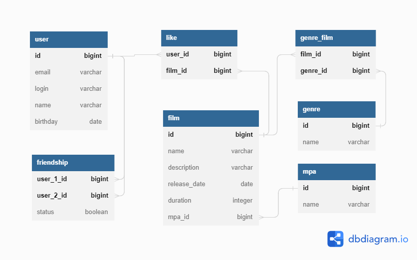

# java-filmorate
## ER-диаграмма


### Таблица _film_ 

Содержит в себе информацию о фильмах, имеет следующие поля:
- _id_ - идентификатор фильма, _**первичный ключ**_
- _name_ - название фильма
- _description_ - описание фильма
- _release_date_ - дата выхода
- _duration_ - длительность в минутах
- _mpa_id_ - идентификатор возрастного ограничения,
   _**внешний ключ**_ на таблицу _mpa_

### Таблица _user_

Содержит в себе информацию о пользователях, имеет следующие поля:
- _id_ - идентификатор пользователя, _**первичный ключ**_
- _email_ - адрес электронной почты
- _login_ - логин пользователя
- _name_ - имя пользователя
- _birthday_ - дата рождения

### Таблица _genre_

Содержит в себе информацию о жанрах, имеет следующие поля:
- _id_ - идентификатор жанра, _**первичный ключ**_
- _name_ - название жанра

### Таблица _genre_film_

Содержит в себе информацию о фильмах и их жанрах, имеет следующие поля:
- _film_id_ - идентификатор фильма, _**внешний ключ**_ на таблицу _film_
- _genre_id_ - идентификатор жанра, _**внешний ключ**_ на таблицу _genre_

_Один фильм может иметь несколько жанров, и наоборот, один жанр может быть
присвоен нескольким фильмам -> связь многие-ко-многим
(через таблицу genre_film)_

### Таблица _mpa_

Содержит в себе информацию о возрастном ограничении, имеет следующие поля:
- _id_ - идентификатор ограничения, _**первичный ключ**_
- _name_ - наименование

_У фильма может быть **только** одно возрастное ограничение, 
но одно возрастное ограничение может быть у нескольких фильмов 
-> связь один-ко-многим (через внешний ключ на таблицу mpa в таблице film)_

### Таблица _friendship_

Содержит в себе информацию о дружбе двух пользователей, имеет следующие поля:
- _user_1_id_ - идентификатор пользователя, _**первичный ключ**_,
 _**внешний ключ**_ на таблицу _user_
- _user_2_id_ - идентификатор пользователя, _**первичный ключ**_,
  _**внешний ключ**_ на таблицу _user_
- _status_ - статус запроса на дружбу 
   (_**true**_ - дружба принята; _**false**_ - не принята)

### Таблица _like_

Содержит в себе информацию о том, какие фильмы лайкнул пользователь,
имеет следующие поля:
- _user_id_ - идентификатор пользователя, _**первичный ключ**_,
  _**внешний ключ**_ на таблицу _user_
- _film_id_ - идентификатор фильма, _**первичный ключ**_,
  _**внешний ключ**_ на таблицу _film_

_У фильма могут быть лайки от нескольких пользователей, и
пользователь может лайкнуть несколько фильмов, не повторяясь 
-> связь многие-ко-многим (через таблицу like)_

## Примеры SQL-запросов 

Вывести все названия фильмов, рейтинг которых R:
```roomsql
SELECT f.name
FROM films AS f
INNER JOIN mpa ON f.mpa_id=mpa.id
WHERE mpa.name='R'
```
Вывести фильмы, рейтинг которых PG, и их жанры:
```roomsql
SELECT f.name,
       g.name
FROM film AS f
INNER JOIN genre_films AS gf ON gf.film_id=f.id
INNER JOIN genre AS g ON gf.genre_id=g.id
INNER JOIN mpa ON f.mpa_id=mpa.id
WHERE mpa.name='PG'
GROUP BY f.name,
         g.name;
```
Вывести все фильмы, которые лайкнул пользователь с id равным 1:
```roomsql
SELECT f.name
FROM film AS f
INNER JOIN likes AS l ON l.film_id=f.id
INNER JOIN user AS u ON l.user_id=u.id
WHERE u.id=1;
```